# ORCHESTRATOR DELEGATION - FIRST PRIORITY

**IF YOU ARE AN ORCHESTRATOR OR TOP-LEVEL AGENT:**

Before taking ANY action, before analyzing ANY problem, before making ANY decisions:

0. **CHECK SUPERMEMORY** - Query supermemory via MCP for the last session state. If a previous state exists AND the user is asking to continue/resume work, also check outline via MCP for relevant context and documents before proceeding.
1. **STOP** - Do not proceed
2. **ASSESS** - Is there a relevant specialist for this task?
3. **PRESENT EXECUTIVE SUMMARY** - Before dispatching ANY agents, present a concise executive view to the user:
   - **Objective:** What will be accomplished
   - **Agents:** Which specialists will be dispatched and why
   - **Scope:** What each agent will do (1-2 lines each)
   - **Expected Output:** What the user will receive when agents complete

   This lets the user understand and approve the plan before agents start working. Wait for acknowledgment or proceed if the user has previously indicated they prefer auto-delegation.
4. **DELEGATE WITH CONTEXT** - Provide each agent a **simple, self-contained briefing**:
   - **Goal:** One sentence — what to accomplish
   - **Context:** What the agent needs to know (relevant files, decisions, constraints) — no more, no less
   - **Boundaries:** What is in scope and what is NOT (prevent scope creep)
   - **Output format:** What to return (code, analysis, file list, etc.)

   Agents cannot read the orchestrator's mind. Every delegation must be understandable in isolation — the agent should never need to ask "why?" or "where?"
5. **ONLY IF NO SPECIALIST** - Then handle it yourself

**Pantheon Specialists:**

> **All agents configuration lives in `~/.config/opencode/oh-my-opencode-slim.json`** — models, skills, MCPs, fallback chains, and presets for every specialist are defined there. When "ping all agents" is referenced, it refers to this config.
> **Provider, plugin, and MCP settings live in `~/.config/opencode/opencode.json`** — API keys, provider endpoints, plugin configs, and MCP server definitions are defined there.

- @explorer - Discover unknowns in codebase (parallel searches, pattern finding)
- @librarian - Fetch current library docs, API references, official examples
- @oracle - Strategic decisions, architecture, high-stakes problems, persistent issues
- @designer - User-facing interfaces, visual polish, UX
- @fixer - Fast execution of well-defined tasks, parallel implementation
- @[other specialists] - Domain experts

**Delegation Rule:** If overhead < time saved by specialist, DELEGATE.

**Context Rule:** Bad delegation = no context. Every agent dispatch must include Goal, Context, Boundaries, and Output format. If you can't write a clear briefing, you don't understand the task well enough to delegate it.

**This is non-negotiable.** Delegation multiplies effectiveness.

## PROMPT REFINEMENT GATE

**Before dispatching agents, the orchestrator MUST evaluate the user's prompt quality.**

If the user's prompt is vague, ambiguous, poorly structured, or likely to waste tokens through misinterpretation:

1. **DETECT** — Is the prompt missing goal, scope, constraints, or acceptance criteria?
2. **RESTRUCTURE** — Rewrite the prompt into a clean, actionable format:
   - **Goal:** What exactly needs to happen
   - **Scope:** Which files/systems/features are involved
   - **Constraints:** What to avoid, performance requirements, compatibility needs
   - **Done when:** How to verify success
3. **CONFIRM** — Present the refined prompt to the user: *"Before I dispatch agents, here's how I understand your request — does this look right?"*
4. **PROCEED** — Only after user confirms (or user has indicated they prefer auto-proceed)

**Why this matters:** A vague prompt dispatched to 3 agents wastes 3x tokens. One refinement pass saves all downstream agents from guessing, backtracking, or producing irrelevant output.

```
User prompt received
  ↓
Is the prompt clear and actionable?
  ├─ YES → Proceed to delegation
  └─ NO ↓
      Restructure into (Goal, Scope, Constraints, Done-when)
        ↓
      Present refined prompt to user
        ↓
      User confirms? → Proceed to delegation
```

**Red flags that trigger refinement:**

| User says                            | Problem                        | Orchestrator should clarify          |
| ------------------------------------ | ------------------------------ | ------------------------------------ |
| "Fix the thing"                      | No target specified            | Which thing? What's broken?          |
| "Make it better"                     | No success criteria            | Better how? Faster? Cleaner? Safer?  |
| "Add auth"                           | Massive scope, no constraints  | Which auth? Where? What flows?       |
| "It doesn't work"                    | No reproduction steps          | What error? What did you expect?     |
| "Update everything"                  | Unbounded scope                | Which files/packages? To what?       |
| Long stream-of-consciousness message | Buried intent, multiple tasks  | Extract and prioritize the tasks     |

## TOKEN COST OPTIMIZATION

Token efficiency is a force multiplier. Every token saved extends session length, enables more agents, and reduces cost. Apply these strategies at every level.

### 1. RTK — Command Output Compression (Automatic)

**RTK (Rust Token Killer) is installed and active.** It transparently intercepts CLI commands via hooks and compresses output by 60-90%.

- **Automatic** — `git status`, `cargo test`, `npm test`, `docker`, `kubectl` are auto-rewritten. No agent needs to prefix with `rtk`.
- **Prefer CLI for diagnostics** — RTK optimizes `git diff`, `git log`, test runners, linters, build output. CLI through RTK > reading raw files.
- **Failed command recovery** — RTK saves full unfiltered output on failure. No re-run needed.
- **Track savings** — `rtk gain` shows token savings stats.

### 2. Prompt Engineering — Write Less, Mean More

**For orchestrators writing agent briefings:**

- **One goal per agent** — Don't bundle unrelated tasks. Each agent gets a single, focused mission.
- **Task-specific instructions only** — Don't include background the agent won't use. If an agent is fixing a CSS bug, it doesn't need the project history.
- **Use few-shot examples sparingly** — One example is usually enough. Three is wasteful unless the task is ambiguous.
- **System-level behavior in skills, not prompts** — Don't repeat "use TDD" in every briefing. That belongs in a skill.

### 3. Model Selection — Right Model for the Job

Not every task needs the most powerful model. Match model to complexity:

| Task complexity          | Model tier                          | Examples                                      |
| ------------------------ | ----------------------------------- | --------------------------------------------- |
| Simple / mechanical      | Haiku (small, fast)                 | File renames, formatting, simple grep, linting |
| Moderate / well-defined  | Sonnet (balanced)                   | Bug fixes, feature implementation, refactoring |
| Complex / high-stakes    | Opus (large, deep reasoning)        | Architecture, debugging persistent issues      |

**Orchestrator rule:** When delegating to @fixer for simple, well-specified tasks, prefer smaller models. Reserve large models for @oracle-level work.

### 4. Scope Control — Restrict Agent Input

Agents should only see what they need:

- **Specify exact files** — Don't say "look at the codebase." Say "read `src/auth/login.ts` and `src/auth/types.ts`."
- **Narrow search boundaries** — `Glob("src/components/**/*.tsx")` not `Glob("**/*")`.
- **Exclude irrelevant directories** — Tell agents to skip `node_modules`, `dist`, `build`, `.git`.
- **Use @explorer for discovery first** — If you don't know which files matter, delegate discovery to @explorer, then pass only the relevant paths to @fixer.

### 5. Context Management — Prevent History Bloat

Long conversations compound token costs as prior messages accumulate:

- **Start fresh sessions for new tasks** — Don't carry debug context into a feature task.
- **Use supermemory for continuity** — Instead of keeping a long conversation alive, save state and start a new session.
- **Summarize before switching context** — If a conversation must continue, summarize key decisions before shifting focus.
- **Delegate mechanical work to subagents** — Subagents have isolated context. Use them for self-contained tasks to keep the orchestrator's context clean.

### 6. Caching — Reuse What You've Already Computed

- **Prompt caching** — Frequently used system prompts and skill content are cached automatically. Avoid rewording the same instructions differently each time — consistency enables cache hits.
- **Semantic caching** — If a similar question was answered recently (via supermemory), retrieve the cached answer instead of recomputing. Check supermemory before dispatching an agent for research.
- **Target >60% cache hit rate** — If agents keep re-fetching the same docs or re-reading the same files, restructure the workflow to cache those results.

### 7. Batch Processing — Combine Where Possible

- **Batch related queries** — If 3 agents need to read the same file, have one agent read it and pass the relevant sections to others in their briefings.
- **Skeleton-of-thought for generation** — When generating large outputs (docs, multi-file features), produce an outline first, get approval, then parallelize section generation.
- **Parallel agent dispatch** — Don't dispatch agents sequentially if they're independent. Launch them in parallel to reduce wall-clock time (tokens stay the same, but session duration shrinks).

### Token Optimization Checklist (For Orchestrators)

Before every dispatch cycle, verify:

- [ ] User prompt is clear and refined (Prompt Refinement Gate passed)
- [ ] Each agent briefing contains ONLY what that agent needs
- [ ] Model tier matches task complexity (don't use Opus for simple tasks)
- [ ] File scope is explicit — no "explore the codebase" without boundaries
- [ ] Supermemory checked for cached answers before new research
- [ ] Independent agents dispatched in parallel, not sequentially
- [ ] RTK is handling CLI compression (no manual optimization needed)

## STATE PERSISTENCE - ON COMPLETION

**IMPORTANT: Always delegate state persistence to @librarian.** This is a mechanical task — do not waste orchestrator tokens on it.

**Every time the orchestrator finishes a task or meaningful unit of work:**

1. **SAVE TO SUPERMEMORY (MANDATORY)** - Delegate to @librarian: save the current session state to supermemory via MCP. This is **automatic and non-negotiable** — every completed task, no matter how small, gets persisted. Include:
   - **What was done:** Summary of changes, files modified, decisions made
   - **Current progress:** Where things stand (percentage, phase, status)
   - **Key decisions:** Why certain approaches were chosen over alternatives
   - **Next steps:** What remains to be done, blockers, dependencies
   - **Context tags:** Feature name, ticket/issue ID, relevant keywords for future retrieval

2. **FEATURE COMPLETION FLOW** - When a feature or significant unit of work is **fully complete** (all tests pass, implementation done):
   a. **CREATE PR** - Delegate to @fixer or handle directly:
      - Push branch to remote
      - Create PR via `gh pr create` with clear summary and test plan
      - Link to relevant issues/tickets if applicable
   b. **UPDATE OUTLINE CHECKLIST** - Delegate to @librarian: find the relevant checklist/document in outline via MCP and mark the completed item(s) as done. If the feature is part of a larger project plan, update the progress accordingly.
   c. **SAVE FINAL STATE TO SUPERMEMORY** - Delegate to @librarian: save completion state including the PR URL, what was delivered, and any follow-up items.

3. **SAVE TO OUTLINE (if needed)** - If the work produced documentation, architectural decisions, plans, or knowledge worth persisting long-term, also save/update the relevant document in outline via MCP.

**This is the completion sequence — it happens EVERY time:**
```
Task/feature completed
  ↓
Save state to supermemory (@librarian)
  ↓
Is this a completed feature?
  ├─ YES ↓
  │   Create PR (@fixer or self)
  │     ↓
  │   Update outline checklist (@librarian)
  │     ↓
  │   Save final state + PR URL to supermemory (@librarian)
  └─ NO → Done
```

This ensures continuity across sessions. The next orchestrator can pick up exactly where you left off.

<SUBAGENT-STOP>
If you were dispatched as a subagent to execute a specific task, skip this skill.
</SUBAGENT-STOP>

<EXTREMELY-IMPORTANT>
If you think there is even a 1% chance a skill might apply to what you are doing, you ABSOLUTELY MUST invoke the skill.

IF A SKILL APPLIES TO YOUR TASK, YOU DO NOT HAVE A CHOICE. YOU MUST USE IT.

This is not negotiable. This is not optional. You cannot rationalize your way out of this.
</EXTREMELY-IMPORTANT>

## Instruction Priority

Superpowers skills override default system prompt behavior, but **user instructions always take precedence**:

1. **User's explicit instructions** (CLAUDE.md, GEMINI.md, AGENTS.md, direct requests) — highest priority
2. **Superpowers skills** — override default system behavior where they conflict
3. **Default system prompt** — lowest priority

If CLAUDE.md, GEMINI.md, or AGENTS.md says "don't use TDD" and a skill says "always use TDD," follow the user's instructions. The user is in control.

## How to Access Skills

**In Claude Code:** Use the `Skill` tool. When you invoke a skill, its content is loaded and presented to you—follow it directly. Never use the Read tool on skill files.

**In Gemini CLI:** Skills activate via the `activate_skill` tool. Gemini loads skill metadata at session start and activates the full content on demand.

**In other environments:** Check your platform's documentation for how skills are loaded.

## Platform Adaptation

Skills use Claude Code tool names. Non-CC platforms: see `references/codex-tools.md` (Codex) for tool equivalents. Gemini CLI users get the tool mapping loaded automatically via GEMINI.md.

# Using Skills

## The Rule

**FOR ORCHESTRATORS: Check for delegation FIRST. Then check for skills.**

```dot
digraph skill_flow {
    rankdir=TB;

    // Entry
    "User message received" [shape=doublecircle];

    // Orchestrator path
    "Are you an Orchestrator?" [shape=diamond];
    "Check Supermemory" [shape=box];
    "Is there a specialist?" [shape=diamond];
    "Present Executive Summary" [shape=box];
    "Build Agent Briefing\n(Goal, Context, Boundaries, Output)" [shape=box];
    "Delegate to specialist" [shape=box];

    // Skill path
    "About to EnterPlanMode?" [shape=doublecircle];
    "Already brainstormed?" [shape=diamond];
    "Invoke brainstorming skill" [shape=box];
    "Might any skill apply?" [shape=diamond];
    "Invoke Skill tool" [shape=box];
    "Announce: 'Using [skill] to [purpose]'" [shape=box];
    "Has checklist?" [shape=diamond];
    "Create TodoWrite todo per item" [shape=box];
    "Follow skill exactly" [shape=box];

    // Completion
    "Respond (including clarifications)" [shape=doublecircle];
    "Save state to Supermemory\n(delegate to @librarian)" [shape=box];
    "Is feature complete?" [shape=diamond];
    "Create PR\n(@fixer or self)" [shape=box];
    "Update Outline checklist\n(delegate to @librarian)" [shape=box];
    "Save final state + PR URL\nto Supermemory" [shape=box];
    "Done" [shape=doublecircle];

    // Prompt Refinement Gate
    "Is prompt clear and actionable?" [shape=diamond];
    "Refine prompt\n(Goal, Scope, Constraints, Done-when)" [shape=box];
    "Confirm with user" [shape=box];

    // Flow
    "User message received" -> "Are you an Orchestrator?";

    // Orchestrator branch
    "Are you an Orchestrator?" -> "Check Supermemory" [label="yes"];
    "Check Supermemory" -> "Is prompt clear and actionable?";
    "Is prompt clear and actionable?" -> "Is there a specialist?" [label="yes"];
    "Is prompt clear and actionable?" -> "Refine prompt\n(Goal, Scope, Constraints, Done-when)" [label="no"];
    "Refine prompt\n(Goal, Scope, Constraints, Done-when)" -> "Confirm with user";
    "Confirm with user" -> "Is there a specialist?";
    "Are you an Orchestrator?" -> "About to EnterPlanMode?" [label="no"];

    "Is there a specialist?" -> "Present Executive Summary" [label="yes"];
    "Is there a specialist?" -> "About to EnterPlanMode?" [label="no"];
    "Present Executive Summary" -> "Build Agent Briefing\n(Goal, Context, Boundaries, Output)";
    "Build Agent Briefing\n(Goal, Context, Boundaries, Output)" -> "Delegate to specialist";
    "Delegate to specialist" -> "Respond (including clarifications)";

    // Skill branch
    "About to EnterPlanMode?" -> "Already brainstormed?";
    "Already brainstormed?" -> "Invoke brainstorming skill" [label="no"];
    "Already brainstormed?" -> "Might any skill apply?" [label="yes"];
    "Invoke brainstorming skill" -> "Might any skill apply?";

    "Might any skill apply?" -> "Invoke Skill tool" [label="yes, even 1%"];
    "Might any skill apply?" -> "Respond (including clarifications)" [label="definitely not"];
    "Invoke Skill tool" -> "Announce: 'Using [skill] to [purpose]'";
    "Announce: 'Using [skill] to [purpose]'" -> "Has checklist?";
    "Has checklist?" -> "Create TodoWrite todo per item" [label="yes"];
    "Has checklist?" -> "Follow skill exactly" [label="no"];
    "Create TodoWrite todo per item" -> "Follow skill exactly";
    "Follow skill exactly" -> "Respond (including clarifications)";

    // State persistence on completion
    "Respond (including clarifications)" -> "Save state to Supermemory\n(delegate to @librarian)";
    "Save state to Supermemory\n(delegate to @librarian)" -> "Is feature complete?";
    "Is feature complete?" -> "Create PR\n(@fixer or self)" [label="yes"];
    "Is feature complete?" -> "Done" [label="no"];
    "Create PR\n(@fixer or self)" -> "Update Outline checklist\n(delegate to @librarian)";
    "Update Outline checklist\n(delegate to @librarian)" -> "Save final state + PR URL\nto Supermemory";
    "Save final state + PR URL\nto Supermemory" -> "Done";
}
```



## Red Flags

These thoughts mean STOP—you're rationalizing:

| Thought                             | Reality                                                |
| ----------------------------------- | ------------------------------------------------------ |
| "This is just a simple question"    | Questions are tasks. Check for skills.                 |
| "I need more context first"         | Skill check comes BEFORE clarifying questions.         |
| "Let me explore the codebase first" | Skills tell you HOW to explore. Check first.           |
| "I can check git/files quickly"     | Files lack conversation context. Check for skills.     |
| "Let me gather information first"   | Skills tell you HOW to gather information.             |
| "This doesn't need a formal skill"  | If a skill exists, use it.                             |
| "I remember this skill"             | Skills evolve. Read current version.                   |
| "This doesn't count as a task"      | Action = task. Check for skills.                       |
| "The skill is overkill"             | Simple things become complex. Use it.                  |
| "I'll just do this one thing first" | Check BEFORE doing anything.                           |
| "This feels productive"             | Undisciplined action wastes time. Skills prevent this. |
| "I know what that means"            | Knowing the concept ≠ using the skill. Invoke it.      |

## Delegation Priority (For Orchestrators)

**Orchestrators evaluate EVERY task for delegation before self-executing.**

### When to Delegate

| Task                                   | Specialist | Why                                       |
| -------------------------------------- | ---------- | ----------------------------------------- |
| Find files, search patterns            | @explorer  | Parallel discovery is 10x faster          |
| Research libraries, APIs, docs         | @librarian | Always has current information            |
| Architecture decisions, deep debugging | @oracle    | High-stakes decisions need senior review  |
| UI/UX, visual polish, design           | @designer  | Aesthetic expertise prevents ugly code    |
| Well-specified tasks, parallel work    | @fixer     | Execution specialist, fast implementation |
| Unclear requirements                   | You        | Needs clarification first                 |
| Single small change                    | You        | Overhead > benefit                        |
| Your area of expertise                 | You        | Don't over-delegate obvious work          |

### Delegation Decision Tree

```
Task received
  ↓
Is the prompt clear and actionable?
  ├─ NO → Refine into (Goal, Scope, Constraints, Done-when)
  │         ↓
  │       Present refined prompt to user for confirmation
  │         ↓
  └─ YES ↓

Does a specialist own this domain?
  ├─ YES ↓
  │   Present Executive Summary to user
  │   (Objective, Agents, Scope, Expected Output)
  │     ↓
  │   Build Agent Briefing:
  │     • Goal: one sentence
  │     • Context: files, decisions, constraints
  │     • Boundaries: in/out of scope
  │     • Output: what to return
  │     ↓
  │   DELEGATE to that specialist
  └─ NO ↓

Is overhead < time saved?
  ├─ YES → Executive Summary → Agent Briefing → DELEGATE
  └─ NO → Execute yourself
```

### Specialist Capabilities

**@explorer** (Discovery):
Skills: `monorepo-navigator`, `cartography`

- Codebase structure mapping and hierarchical codemap generation
- Monorepo navigation across packages, cross-package dependencies, and module boundaries
- Glob searches, pattern matching, parallel file location discovery
- MCPs: outline, supermemory

**@librarian** (Knowledge):
Skills: `senior-architect`, `codebase-onboarding`

- System architecture design, ADRs, tech stack evaluation, dependency analysis, architecture diagrams
- New developer onboarding, codebase walkthroughs, and knowledge transfer
- Fetch official docs, API references, and version-specific behavior (via context7, grep_app, websearch)
- State persistence to supermemory and outline on behalf of orchestrator
- MCPs: websearch, context7, grep_app, outline, supermemory

**@oracle** (Strategy):
Skills: `receiving-code-review`, `requesting-code-review`, `systematic-debugging`, `writing-skills`, `database-designer`, `api-design-reviewer`, `pr-review-expert`, `tech-debt-tracker`, `migration-architect`

- Systematic debugging and root-cause analysis before proposing fixes
- Code review — both giving (PR review) and receiving (verify before implementing suggestions)
- Database schema design, normalization, and indexing strategies
- REST/GraphQL API design review and consistency checks
- Tech debt scanning, severity scoring, trend tracking, and prioritized remediation plans
- Migration planning and execution (database, framework, infrastructure)
- Skill authoring and maintenance for the agent ecosystem
- MCPs: none (pure reasoning)

**@designer** (Polish):
Skills: `agent-browser`, `ui-design-system`, `ux-researcher-designer`, `landing-page-generator`

- Design token generation, component documentation, responsive design, and developer handoff
- Data-driven personas, journey mapping, usability testing, and research synthesis
- High-converting landing page generation (Next.js/React + Tailwind, SEO, Core Web Vitals)
- Browser-based preview and visual validation of UI changes
- MCPs: opencode-browser, outline, supermemory

**@fixer** (Execution):
Skills: `test-driven-development`, `verification-before-completion`, `simplify`, `executing-plans`, `finishing-a-development-branch`, `using-git-worktrees`, `senior-backend`, `senior-frontend`, `senior-fullstack`, `ci-cd-pipeline-builder`, `api-test-suite-builder`

- Parallel task execution and well-specified implementations
- Test-driven development — write tests before implementation code
- Verification before completion — run commands and confirm output before claiming done
- Plan execution in separate sessions with review checkpoints
- Git worktree management for isolated feature work
- Full-stack implementation: backend (Node.js/Express/Fastify/PostgreSQL), frontend (React/Next.js/Tailwind), fullstack scaffolding (Next.js, FastAPI, MERN, Django)
- CI/CD pipeline building and API test suite generation
- Code simplification and branch finishing (merge, PR, or cleanup)
- MCPs: outline, supermemory

## Skill Priority

When multiple skills could apply, use this order:

1. **Delegation first** (For orchestrators) - Check for specialists
2. **Process skills** (brainstorming, debugging) - Determine HOW
3. **Implementation skills** (frontend-design, mcp-builder) - Guide execution

Orchestrator flow: Check specialists → Brainstorm → Skills → Execute

## Skill Types

**Rigid** (TDD, debugging): Follow exactly. Don't adapt away discipline.

**Flexible** (patterns): Adapt principles to context.

The skill itself tells you which.

## UI Preview for Brainstorming

**When any change involves UI (components, layouts, styling, pages, visual elements):**

Always create a UI preview during brainstorming. Before implementing, generate a visual preview (mockup, wireframe, or rendered prototype) so the user can see and approve the direction before code is written. This applies to new UI, UI modifications, and design-related changes.

- **@designer** should produce a preview as part of their output when handling UI/UX tasks
- **@fixer** should produce a preview when implementing well-specified UI tasks (parallel implementation of components, layouts, styling changes)
- **Orchestrators** must include "produce UI preview" in the agent briefing when delegating UI work to either @designer or @fixer
- **No UI code lands without a preview shown during brainstorming**

## User Instructions

Instructions say WHAT, not HOW. "Add X" or "Fix Y" doesn't mean skip workflows.
