<SUBAGENT-STOP>
If you were dispatched as a subagent to execute a specific task, skip this skill.
</SUBAGENT-STOP>

<EXTREMELY-IMPORTANT>
If you think there is even a 1% chance a skill might apply to what you are doing, you ABSOLUTELY MUST invoke the skill.

IF A SKILL APPLIES TO YOUR TASK, YOU DO NOT HAVE A CHOICE. YOU MUST USE IT.

This is not negotiable. This is not optional. You cannot rationalize your way out of this.
</EXTREMELY-IMPORTANT>

## Instruction Priority

Superpowers skills override default system prompt behavior, but **user instructions always take precedence**:

1. **User's explicit instructions** (CLAUDE.md, GEMINI.md, AGENTS.md, direct requests) — highest priority
2. **Superpowers skills** — override default system behavior where they conflict
3. **Default system prompt** — lowest priority

If CLAUDE.md, GEMINI.md, or AGENTS.md says "don't use TDD" and a skill says "always use TDD," follow the user's instructions. The user is in control.

## How to Access Skills

**In Claude Code:** Use the `Skill` tool. When you invoke a skill, its content is loaded and presented to you—follow it directly. Never use the Read tool on skill files.

**In Gemini CLI:** Skills activate via the `activate_skill` tool. Gemini loads skill metadata at session start and activates the full content on demand.

**In other environments:** Check your platform's documentation for how skills are loaded.

## Platform Adaptation

Skills use Claude Code tool names. Non-CC platforms: see `references/codex-tools.md` (Codex) for tool equivalents. Gemini CLI users get the tool mapping loaded automatically via GEMINI.md.

# Using Skills

## The Rule

**FOR ORCHESTRATORS: Check for delegation FIRST. Then check for skills.**

```dot
digraph skill_flow {
    rankdir=TB;

    // Entry
    "User message received" [shape=doublecircle];

    // Orchestrator path
    "Are you an Orchestrator?" [shape=diamond];
    "Check Supermemory" [shape=box];
    "Is there a specialist?" [shape=diamond];
    "Present Executive Summary" [shape=box];
    "Build Agent Briefing\n(Goal, Context, Boundaries, Output)" [shape=box];
    "Delegate to specialist" [shape=box];

    // Skill path
    "About to EnterPlanMode?" [shape=doublecircle];
    "Already brainstormed?" [shape=diamond];
    "Invoke brainstorming skill" [shape=box];
    "Might any skill apply?" [shape=diamond];
    "Invoke Skill tool" [shape=box];
    "Announce: 'Using [skill] to [purpose]'" [shape=box];
    "Has checklist?" [shape=diamond];
    "Create TodoWrite todo per item" [shape=box];
    "Follow skill exactly" [shape=box];

    // Completion
    "Respond (including clarifications)" [shape=doublecircle];
    "Save state to Supermemory\n(delegate to @librarian)" [shape=box];
    "Done" [shape=doublecircle];

    // Prompt Refinement Gate
    "Is prompt clear and actionable?" [shape=diamond];
    "Refine prompt\n(Goal, Scope, Constraints, Done-when)" [shape=box];
    "Confirm with user" [shape=box];

    // Flow
    "User message received" -> "Are you an Orchestrator?";

    // Orchestrator branch
    "Are you an Orchestrator?" -> "Check Supermemory" [label="yes"];
    "Check Supermemory" -> "Is prompt clear and actionable?";
    "Is prompt clear and actionable?" -> "Is there a specialist?" [label="yes"];
    "Is prompt clear and actionable?" -> "Refine prompt\n(Goal, Scope, Constraints, Done-when)" [label="no"];
    "Refine prompt\n(Goal, Scope, Constraints, Done-when)" -> "Confirm with user";
    "Confirm with user" -> "Is there a specialist?";
    "Are you an Orchestrator?" -> "About to EnterPlanMode?" [label="no"];

    "Is there a specialist?" -> "Present Executive Summary" [label="yes"];
    "Is there a specialist?" -> "About to EnterPlanMode?" [label="no"];
    "Present Executive Summary" -> "Build Agent Briefing\n(Goal, Context, Boundaries, Output)";
    "Build Agent Briefing\n(Goal, Context, Boundaries, Output)" -> "Delegate to specialist";
    "Delegate to specialist" -> "Respond (including clarifications)";

    // Skill branch
    "About to EnterPlanMode?" -> "Already brainstormed?";
    "Already brainstormed?" -> "Invoke brainstorming skill" [label="no"];
    "Already brainstormed?" -> "Might any skill apply?" [label="yes"];
    "Invoke brainstorming skill" -> "Might any skill apply?";

    "Might any skill apply?" -> "Invoke Skill tool" [label="yes, even 1%"];
    "Might any skill apply?" -> "Respond (including clarifications)" [label="definitely not"];
    "Invoke Skill tool" -> "Announce: 'Using [skill] to [purpose]'";
    "Announce: 'Using [skill] to [purpose]'" -> "Has checklist?";
    "Has checklist?" -> "Create TodoWrite todo per item" [label="yes"];
    "Has checklist?" -> "Follow skill exactly" [label="no"];
    "Create TodoWrite todo per item" -> "Follow skill exactly";
    "Follow skill exactly" -> "Respond (including clarifications)";

    // State persistence on completion
    "Respond (including clarifications)" -> "Save state to Supermemory\n(delegate to @librarian)";
    "Save state to Supermemory\n(delegate to @librarian)" -> "Done";
}
```



## Red Flags

These thoughts mean STOP—you're rationalizing:

| Thought                             | Reality                                                |
| ----------------------------------- | ------------------------------------------------------ |
| "This is just a simple question"    | Questions are tasks. Check for skills.                 |
| "I need more context first"         | Skill check comes BEFORE clarifying questions.         |
| "Let me explore the codebase first" | Skills tell you HOW to explore. Check first.           |
| "I can check git/files quickly"     | Files lack conversation context. Check for skills.     |
| "Let me gather information first"   | Skills tell you HOW to gather information.             |
| "This doesn't need a formal skill"  | If a skill exists, use it.                             |
| "I remember this skill"             | Skills evolve. Read current version.                   |
| "This doesn't count as a task"      | Action = task. Check for skills.                       |
| "The skill is overkill"             | Simple things become complex. Use it.                  |
| "I'll just do this one thing first" | Check BEFORE doing anything.                           |
| "This feels productive"             | Undisciplined action wastes time. Skills prevent this. |
| "I know what that means"            | Knowing the concept ≠ using the skill. Invoke it.      |

## Delegation Priority (For Orchestrators)

**Orchestrators evaluate EVERY task for delegation before self-executing.**

### When to Delegate

| Task                                   | Specialist | Why                                       |
| -------------------------------------- | ---------- | ----------------------------------------- |
| Find files, search patterns            | @explorer  | Parallel discovery is 10x faster          |
| Research libraries, APIs, docs         | @librarian | Always has current information            |
| Architecture decisions, deep debugging | @oracle    | High-stakes decisions need senior review  |
| UI/UX, visual polish, design           | @designer  | Aesthetic expertise prevents ugly code    |
| Well-specified tasks, parallel work    | @fixer     | Execution specialist, fast implementation |
| Unclear requirements                   | You        | Needs clarification first                 |
| Single small change                    | You        | Overhead > benefit                        |
| Your area of expertise                 | You        | Don't over-delegate obvious work          |

### Delegation Decision Tree

```
Task received
  ↓
Is the prompt clear and actionable?
  ├─ NO → Refine into (Goal, Scope, Constraints, Done-when)
  │         ↓
  │       Present refined prompt to user for confirmation
  │         ↓
  └─ YES ↓

Does a specialist own this domain?
  ├─ YES ↓
  │   Present Executive Summary to user
  │   (Objective, Agents, Scope, Expected Output)
  │     ↓
  │   Build Agent Briefing:
  │     • Goal: one sentence
  │     • Context: files, decisions, constraints
  │     • Boundaries: in/out of scope
  │     • Output: what to return
  │     ↓
  │   DELEGATE to that specialist
  └─ NO ↓

Is overhead < time saved?
  ├─ YES → Executive Summary → Agent Briefing → DELEGATE
  └─ NO → Execute yourself
```

### Specialist Capabilities

**@explorer** (Discovery):

- Glob searches across codebase
- Pattern matching and regex
- File location discovery
- Codebase structure mapping
- Parallel searches

**@librarian** (Knowledge):

- Fetch official documentation
- API reference lookups
- Version-specific behavior
- Best practices and examples
- Complex API navigation

**@oracle** (Strategy):

- Architecture decisions
- System design reviews
- Complex debugging
- Trade-off analysis
- High-stakes guidance

**@designer** (Polish):

- UI/UX implementation
- Visual consistency
- Responsive layouts
- Animation and interaction
- Aesthetic improvement

**@fixer** (Execution):

- Parallel task execution
- Well-specified implementations
- Testing and verification
- Rapid prototyping
- Multi-location changes

## Skill Priority

When multiple skills could apply, use this order:

1. **Delegation first** (For orchestrators) - Check for specialists
2. **Process skills** (brainstorming, debugging) - Determine HOW
3. **Implementation skills** (frontend-design, mcp-builder) - Guide execution

Orchestrator flow: Check specialists → Brainstorm → Skills → Execute

## Skill Types

**Rigid** (TDD, debugging): Follow exactly. Don't adapt away discipline.

**Flexible** (patterns): Adapt principles to context.

The skill itself tells you which.

## User Instructions

Instructions say WHAT, not HOW. "Add X" or "Fix Y" doesn't mean skip workflows.
